# CPU Multithreaded Ray Tracing Engine (C++)

A CPU-based, multithreaded ray tracing system designed as a foundational rendering
engine for exploring physically based light transport, importance sampling,
acceleration structures, volumetric media, and parallel execution on modern
multi-core processors. The implementation emphasizes correctness, architectural
clarity, bitwise-reproducible output, and a framebuffer-first, tile-based rendering
pipeline — serving as a base for future extensions into hardware-accelerated and
backend-specific rendering pipelines.


---

## System Overview

This renderer initially used a scanline-based, single-threaded execution model,
writing pixel results directly to the output stream. While suitable for early
correctness validation, this approach limited scalability and made performance
analysis and backend extensibility difficult.

**The current architecture adopts a framebuffer-first rendering pipeline with tile-based
work decomposition. The image is divided into fixed-size tiles, which are dynamically
scheduled across a pool of CPU worker threads using atomic work distribution. Each tile
is rendered independently into a shared framebuffer, followed by a final output pass.**

**This structural shift improves CPU utilization, enables deterministic and progressive
rendering strategies, simplifies profiling and instrumentation, and establishes a clean
execution model that can be extended toward alternative backends such as GPU-accelerated
or hardware-specific rendering pipelines.**

---

## Light Transport & Importance Sampling

A path tracer that scatters rays uniformly must rely on chance to find light. In a
scene lit by a small emitter, the overwhelming majority of scattered rays never reach
it, and every one of those samples contributes nothing but noise.

This renderer instead samples deliberately. Each scattering surface reports a
probability density describing how it prefers to scatter, and the integrator combines
that density with one aimed directly at the scene's light sources. Directions are drawn
from the mixture and weighted by the ratio of the material's scattering density to the
density actually sampled — which keeps the estimator unbiased while concentrating
samples where the energy is.

The sampling model is built from:

- **Cosine-weighted hemisphere sampling** for diffuse surfaces
- **Direct light sampling**, aiming rays at emitters by solid angle
- **Mixture densities**, combining material and light strategies without bias
- **Orthonormal bases**, for generating directions around an arbitrary normal
- **Specular bypass**, for reflection and refraction where the outgoing direction is
  determined rather than chosen
- **Degenerate-sample rejection**, discarding directions that cannot contribute before
  they reach the estimator

### Result

Both images below render the same Cornell box on the same machine at the same thread
count. The left uses uniform scattering; the right uses the sampling model described
above.

| Uniform scattering — 200 spp, 80.1 s | Importance sampled — 8 spp, 2.0 s |
|:---:|:---:|
|  | 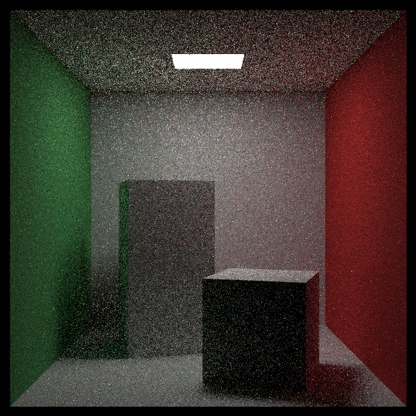 |

The right-hand image uses **25× fewer samples**, renders **39× faster**, and is
measurably *less* noisy than the left. Measured across scenes at equal sample counts,
high-frequency noise fell by **76.6%** in the Cornell box and **58.4%** in the dusk
scene above. Mean radiance shifted by **0.10%** in linear space, confirming the
estimator remains unbiased.

### Convergence

The same scene at rising sample counts. Usable images appear far earlier than uniform
scattering allows.

<table align="center" cellpadding="4" cellspacing="0">
  <tr>
    <td align="center">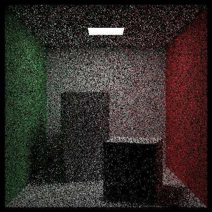<br/><sub><b>1 spp</b></sub></td>
    <td align="center">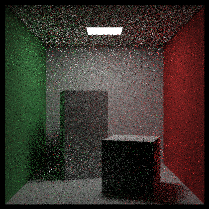<br/><sub><b>4 spp</b></sub></td>
    <td align="center">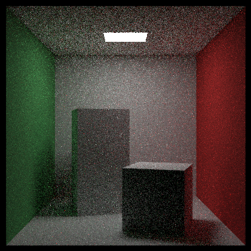<br/><sub><b>16 spp</b></sub></td>
    <td align="center"><br/><sub><b>64 spp</b></sub></td>
    <td align="center"><br/><sub><b>256 spp</b></sub></td>
  </tr>
</table>

### Light Size

The same room with the emitter progressively shrunk, emission scaled by inverse area so
total radiant power stays constant. Shadows sharpen as the source narrows. Smaller
sources are precisely the case uniform scattering handles worst — and direct light
sampling handles best.

<table align="center" cellpadding="4" cellspacing="0">
  <tr>
    <td align="center"><br/><sub><b>Full-size emitter</b></sub></td>
    <td align="center">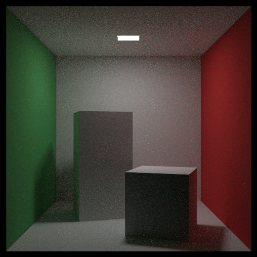<br/><sub><b>Half-edge emitter</b></sub></td>
    <td align="center">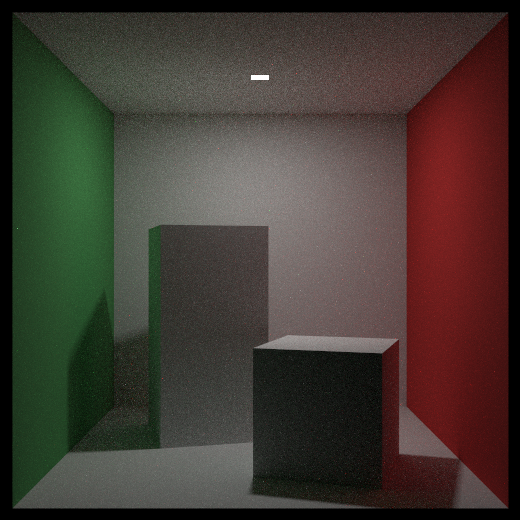<br/><sub><b>Near-pinhole emitter</b></sub></td>
  </tr>
</table>

### Dusk Scene

The featured scene at the top of this page, rendered at identical settings before and
after. It is lit almost entirely by one small sun, which is why it benefits so heavily.

| Uniform scattering | Importance sampled |
|:---:|:---:|
| 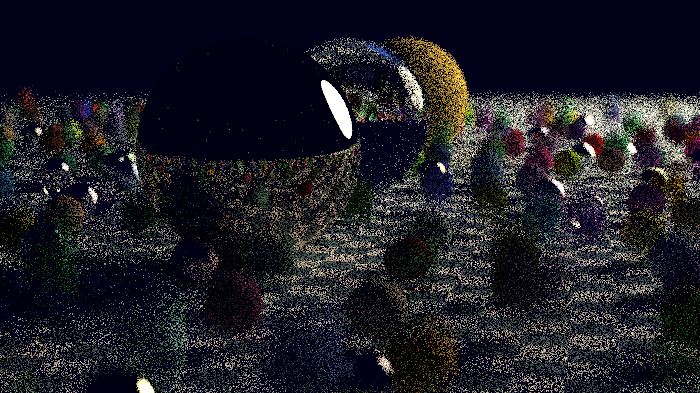 | 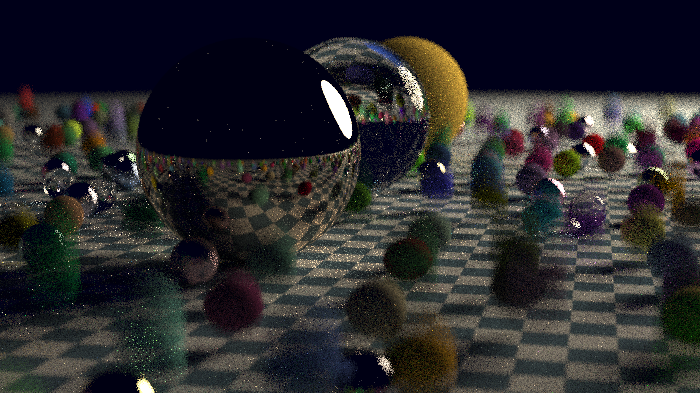 |

---

## Determinism

The renderer supports a deterministic execution mode in which identical inputs produce
bitwise-identical output, independent of thread count or scheduling order — enabling
debugging, benchmarking, and regression testing across backends.

Determinism is achieved through:

- Explicit per-pixel, per-sample RNG seeding
- Elimination of global randomness during rendering — sampling draws only from an RNG
  passed down the call chain, so no ambient random source is reachable from the render
  path
- Deterministic scene construction from a fixed, overridable generator seed
- Deterministic motion blur time sampling and volumetric scattering
- Thread-safe, order-independent accumulation

**Verified**: the same scene rendered at 1, 2 and 4 threads produces byte-identical
output, confirmed by SHA-256 across the Cornell box, the dusk scene, and a
constant-density volumetric scene.

---

## Capabilities

### Rendering
- Recursive path tracing with configurable maximum depth
- Monte Carlo integration with importance-sampled scattering
- Direct light sampling with mixture densities
- Gamma-correct output with NaN rejection
- Deterministic and non-deterministic execution modes
- Configurable worker thread cap

### Sampling
- Probability density abstraction over scattering directions
- Cosine-weighted and uniform-sphere densities
- Geometric sampling of spheres, quadrilaterals and object lists by solid angle
- Mixture densities combining material and light strategies
- Orthonormal basis construction around arbitrary normals

### Geometry
- Static and moving spheres
- Arbitrary quadrilaterals
- Axis-aligned boxes
- Instance transforms — translation and rotation
- Hierarchical scene composition via hittable abstractions
- Support for nested volumetric boundaries

### Materials

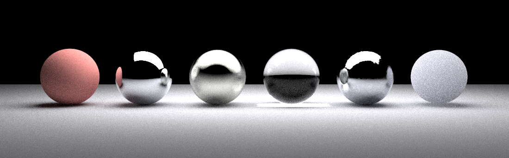

*Lambertian · mirror metal · rough metal · dielectric · noise-driven metal · isotropic medium*

- Lambertian diffuse reflection
- Metallic reflection with controllable roughness
- **Noise-driven metal** — surface roughness modulated by a procedural texture, so a
  single surface varies from polished to matte
- Dielectric materials with refraction and total internal reflection
- Emissive materials for area light sources, emitting from their front face

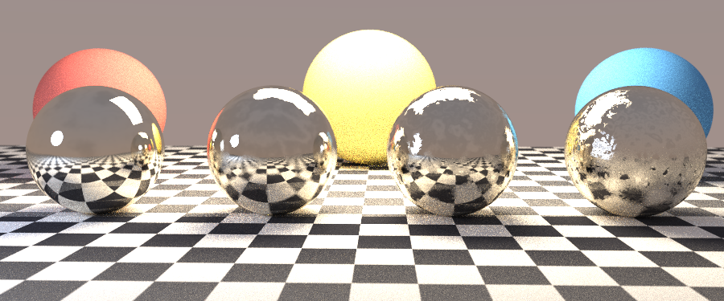

*Roughness increasing left to right. The reflected checkerboard sharpens and softens
with the underlying noise field.*

### Textures

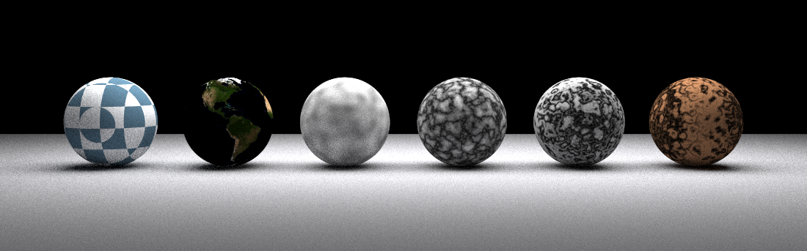

*Checker · image · Perlin · turbulence · marble · wood*

- Solid color textures
- Image-based textures (stb_image)
- Procedural Perlin noise
- Turbulence, marble and wood procedural modes
- Configurable dusk sky gradient with adjustable blend strength

### Volumetrics

| Light shafts through participating media | Media bounded by dielectric surfaces |
|:---:|:---:|
| 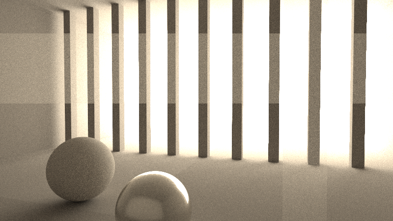 | 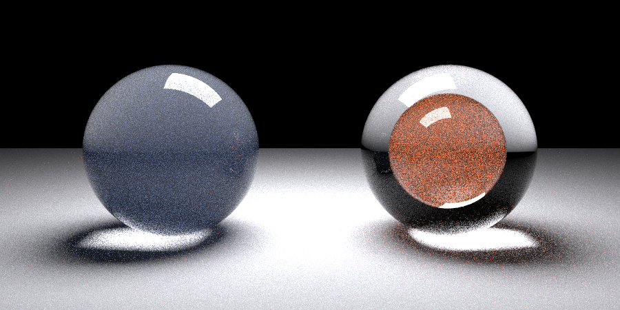 |

- Constant-density participating media
- Isotropic scattering
- Volumetric absorption
- Nested volumetric regions

### Acceleration Structures
- Bounding Volume Hierarchy (BVH)
- Axis-aligned bounding boxes (AABB)

---

## Example Renders

### Dielectrics

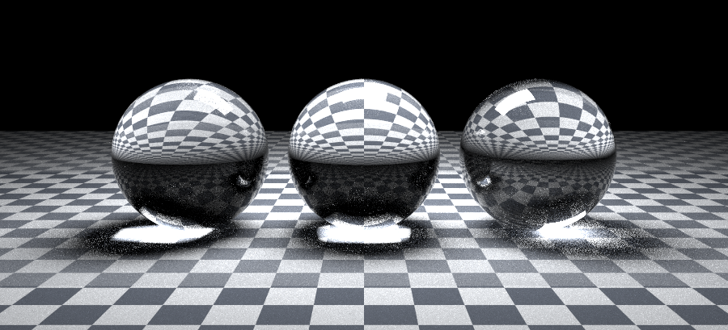

Solid, hollow-shell and high-index dielectrics over a checkered surface, demonstrating
refraction, total internal reflection and nested surface normals.

### Recursive Reflection

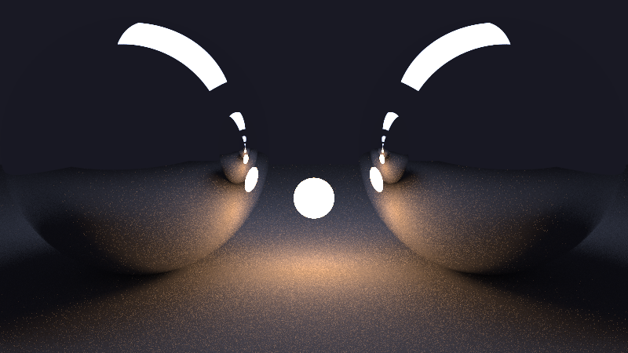

Facing chrome spheres with a small emitter between them, exercising deep recursion and
ray depth limits.

### Multiple Emitters

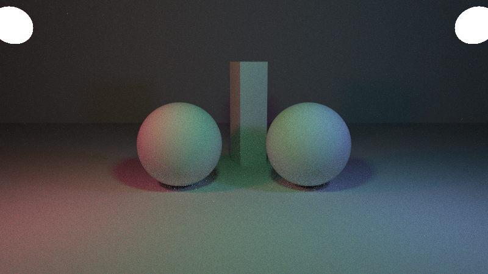

Three coloured emitters producing overlapping tinted shadows, with the light list
sampled across all sources.

### Depth of Field

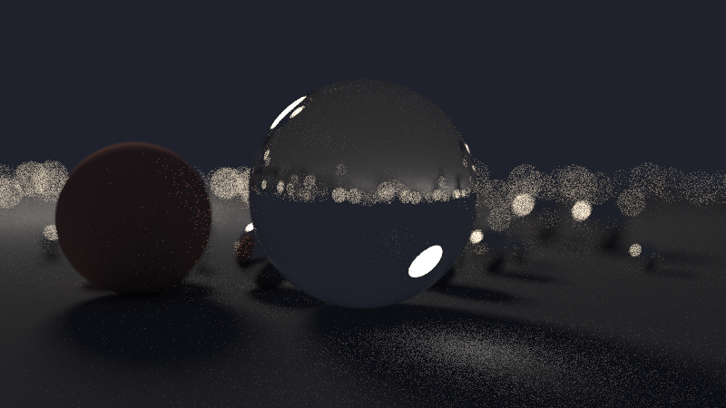

Thin-lens camera with a shallow focal plane, resolving specular highlights into
out-of-focus discs.

---

## Execution Model Comparison

Identical scene, camera, sampling settings and ray depth. The visual output is
bitwise-identical across all three configurations — only work scheduling differs.

<table align="center" border="2" cellpadding="10" cellspacing="0">
  <tr>
    <th align="center">Execution Model</th>
    <th align="center">CPU Configuration</th>
    <th align="center">Render Time</th>
    <th align="center">Throughput</th>
    <th align="center">Speedup</th>
  </tr>
  <tr>
    <td align="center">Single-threaded</td>
    <td align="center">1 thread (Apple M1)</td>
    <td align="center"><strong>18.14 s</strong></td>
    <td align="center">379 k samples/s</td>
    <td align="center">1.00×</td>
  </tr>
  <tr>
    <td align="center">Tile-based multithreaded</td>
    <td align="center">2 threads (Apple M1)</td>
    <td align="center"><strong>10.60 s</strong></td>
    <td align="center">649 k samples/s</td>
    <td align="center">1.71×</td>
  </tr>
  <tr>
    <td align="center">Tile-based multithreaded</td>
    <td align="center">4 threads (Apple M1)</td>
    <td align="center"><strong>5.90 s</strong></td>
    <td align="center">1.16 M samples/s</td>
    <td align="center"><strong>3.07×</strong></td>
  </tr>
</table>

Measured on the dusk scene at 700 px, 25 samples per pixel, deterministic mode. This
comparison isolates the impact of execution model and work decomposition on CPU
utilization, independent of shading, sampling, or scene complexity.

---

## Build & Run

### Requirements

```
- C++17-compatible compiler (clang++ or g++)
- Unix-like environment (macOS or Linux)
```

### Renderer

```
clang++ -std=c++17 -O2 -Iinclude src/main.cpp -o build/raytracer
./build/raytracer > output.ppm
```

### Example Scenes

A separate binary containing the scenes shown throughout this document.

```
clang++ -std=c++17 -O2 -Iinclude tools/gallery.cpp -o build/gallery
./build/gallery list
./build/gallery godrays 900 300 > godrays.ppm
```

### Sampler Validation

Verifies the direction samplers and probability densities against analytically known
results.

```
clang++ -std=c++17 -O2 -Iinclude tools/sampling_check.cpp -o build/sampling_check
./build/sampling_check
```

Note: rendering may take significant time depending on scene complexity and sampling
parameters.

---

## Repository Structure

```
src/       - Application entry point and scene definitions
include/   - Core rendering abstractions and interfaces
tools/     - Example scenes and sampler validation
assets/    - Runtime assets (e.g. textures)
docs/      - Documentation and curated render outputs
external/  - Third-party dependencies (stb_image)
```

---

## Learning Lineage

This project draws from the concepts and techniques presented in Peter Shirley’s
*Ray Tracing in One Weekend* series. The focus of this implementation is on deeply
engaging with the underlying rendering principles and organizing them into a
coherent, extensible system that can serve as a base for further exploration.
